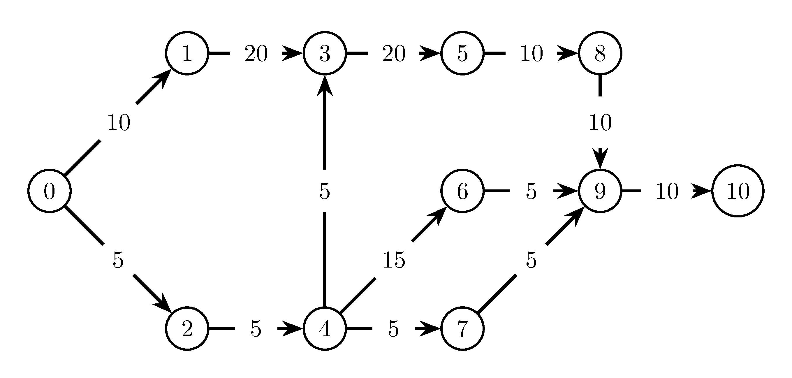
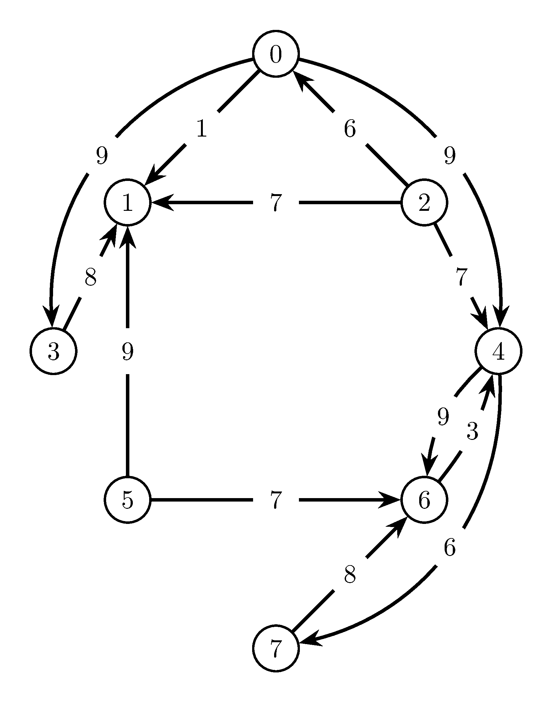
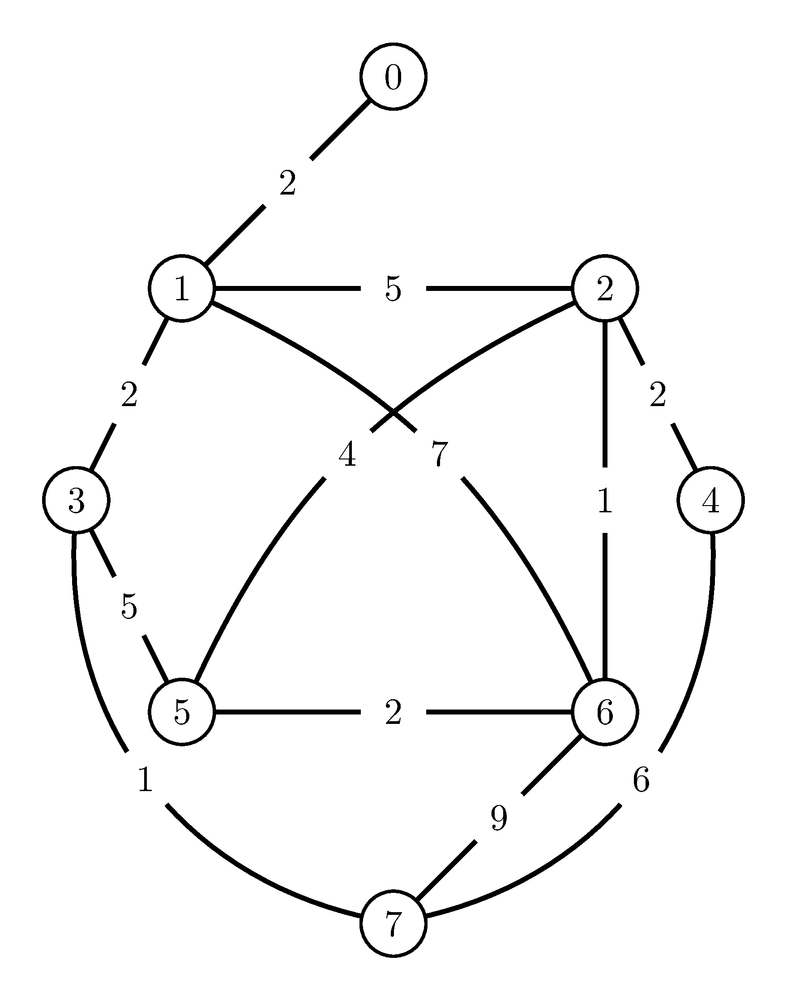
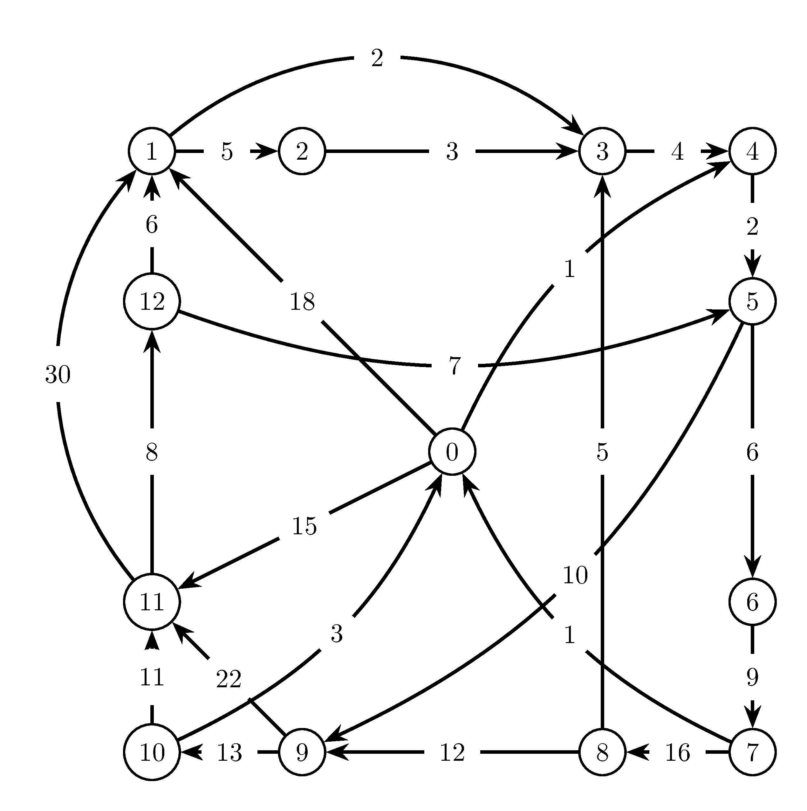

# Practica 6
* [Ejercicio 1](https://github.com/krosf-university/EDNL/blob/master/include/grafos/alg.hpp#L76-L112)
* [Ejercicio 2](https://github.com/krosf-university/EDNL/blob/master/include/practicas/P6.hpp#L18-L48)
* [Ejercicio 3](https://github.com/krosf-university/EDNL/blob/master/include/practicas/P6.hpp#L50-L72)
* [Ejercicio 4](https://github.com/krosf-university/EDNL/blob/master/include/practicas/P6.hpp#L74-L98)

## Grafos
### Aciclico

#### Matriz de Coste
|        |   0   |   1    |   2   |   3    |   4   |   5    |   6    |   7   |   8    |   9    |   10   |
| :----: | :---: | :----: | :---: | :----: | :---: | :----: | :----: | :---: | :----: | :----: | :----: |
| **0**  |   ∞   | **10** | **5** |   ∞    |   ∞   |   ∞    |   ∞    |   ∞   |   ∞    |   ∞    |   ∞    |
| **1**  |   ∞   |   ∞    |   ∞   | **20** |   ∞   |   ∞    |   ∞    |   ∞   |   ∞    |   ∞    |   ∞    |
| **2**  |   ∞   |   ∞    |   ∞   |   ∞    | **5** |   ∞    |   ∞    |   ∞   |   ∞    |   ∞    |   ∞    |
| **3**  |   ∞   |   ∞    |   ∞   |   ∞    |   ∞   | **20** |   ∞    |   ∞   |   ∞    |   ∞    |   ∞    |
| **4**  |   ∞   |   ∞    |   ∞   | **5**  |   ∞   |   ∞    | **15** | **5** |   ∞    |   ∞    |   ∞    |
| **5**  |   ∞   |   ∞    |   ∞   |   ∞    |   ∞   |   ∞    |   ∞    |   ∞   | **10** |   ∞    |   ∞    |
| **6**  |   ∞   |   ∞    |   ∞   |   ∞    |   ∞   |   ∞    |   ∞    |   ∞   |   ∞    | **5**  |   ∞    |
| **7**  |   ∞   |   ∞    |   ∞   |   ∞    |   ∞   |   ∞    |   ∞    |   ∞   |   ∞    | **5**  |   ∞    |
| **8**  |   ∞   |   ∞    |   ∞   |   ∞    |   ∞   |   ∞    |   ∞    |   ∞   |   ∞    | **10** |   ∞    |
| **9**  |   ∞   |   ∞    |   ∞   |   ∞    |   ∞   |   ∞    |   ∞    |   ∞   |   ∞    |   ∞    | **10** |
| **10** |   ∞   |   ∞    |   ∞   |   ∞    |   ∞   |   ∞    |   ∞    |   ∞   |   ∞    |   ∞    |   ∞    |
### Conexo

#### Matriz de Coste
|       |   0   |   1   |   2   |   3   |   4   |   5   |   6   |   7   |
| :---: | :---: | :---: | :---: | :---: | :---: | :---: | :---: | :---: |
| **0** |   ∞   | **1** |   ∞   | **9** | **9** |   ∞   |   ∞   |   ∞   |
| **1** |   ∞   |   ∞   |   ∞   |   ∞   |   ∞   |   ∞   |   ∞   |   ∞   |
| **2** | **6** | **7** |   ∞   |   ∞   | **7** |   ∞   |   ∞   |   ∞   |
| **3** |   ∞   | **8** |   ∞   |   ∞   |   ∞   |   ∞   |   ∞   |   ∞   |
| **4** |   ∞   |   ∞   |   ∞   |   ∞   |   ∞   |   ∞   | **9** | **6** |
| **5** |   ∞   | **9** |   ∞   |   ∞   |   ∞   |   ∞   | **7** |   ∞   |
| **6** |   ∞   |   ∞   |   ∞   |   ∞   | **3** |   ∞   |   ∞   |   ∞   |
| **7** |   ∞   |   ∞   |   ∞   |   ∞   |   ∞   |   ∞   | **8** |   ∞   |
### No Dirigido

#### Matriz de Coste
|       |   0   |   1   |   2   |   3   |   4   |   5   |   6   |   7   |
| :---: | :---: | :---: | :---: | :---: | :---: | :---: | :---: | :---: |
| **0** |   ∞   | **2** |   ∞   |   ∞   |   ∞   |   ∞   |   ∞   |   ∞   |
| **1** | **2** |   ∞   | **5** | **2** |   ∞   |   ∞   | **7** |   ∞   |
| **2** |   ∞   | **5** |   ∞   |   ∞   | **2** | **4** | **1** |   ∞   |
| **3** |   ∞   | **2** |   ∞   |   ∞   |   ∞   | **5** |   ∞   | **1** |
| **4** |   ∞   |   ∞   | **2** |   ∞   |   ∞   |   ∞   |   ∞   | **6** |
| **5** |   ∞   |   ∞   | **4** | **5** |   ∞   |   ∞   | **2** |   ∞   |
| **6** |   ∞   | **7** | **1** |   ∞   |   ∞   | **2** |   ∞   | **9** |
| **7** |   ∞   |   ∞   |   ∞   | **1** | **6** |   ∞   | **9** |   ∞   |
### Zuelandia

#### Matriz de Coste
|        |   0   |   1    |   2   |   3   |   4   |   5   |   6   |   7   |   8    |   9    |   10   |   11   |  12   |
| :----: | :---: | :----: | :---: | :---: | :---: | :---: | :---: | :---: | :----: | :----: | :----: | :----: | :---: |
| **0**  |   ∞   | **18** |   ∞   |   ∞   | **1** |   ∞   |   ∞   |   ∞   |   ∞    |   ∞    |   ∞    | **15** |   ∞   |
| **1**  |   ∞   |   ∞    | **5** | **2** |   ∞   |   ∞   |   ∞   |   ∞   |   ∞    |   ∞    |   ∞    |   ∞    |   ∞   |
| **2**  |   ∞   |   ∞    |   ∞   | **3** |   ∞   |   ∞   |   ∞   |   ∞   |   ∞    |   ∞    |   ∞    |   ∞    |   ∞   |
| **3**  |   ∞   |   ∞    |   ∞   |   ∞   | **4** |   ∞   |   ∞   |   ∞   |   ∞    |   ∞    |   ∞    |   ∞    |   ∞   |
| **4**  |   ∞   |   ∞    |   ∞   |   ∞   |   ∞   | **2** |   ∞   |   ∞   |   ∞    |   ∞    |   ∞    |   ∞    |   ∞   |
| **5**  |   ∞   |   ∞    |   ∞   |   ∞   |   ∞   |   ∞   | **6** |   ∞   |   ∞    | **10** |   ∞    |   ∞    |   ∞   |
| **6**  |   ∞   |   ∞    |   ∞   |   ∞   |   ∞   |   ∞   |   ∞   | **9** |   ∞    |   ∞    |   ∞    |   ∞    |   ∞   |
| **7**  | **1** |   ∞    |   ∞   |   ∞   |   ∞   |   ∞   |   ∞   |   ∞   | **16** |   ∞    |   ∞    |   ∞    |   ∞   |
| **8**  |   ∞   |   ∞    |   ∞   | **5** |   ∞   |   ∞   |   ∞   |   ∞   |   ∞    | **12** |   ∞    |   ∞    |   ∞   |
| **9**  |   ∞   |   ∞    |   ∞   |   ∞   |   ∞   |   ∞   |   ∞   |   ∞   |   ∞    |   ∞    | **13** | **22** |   ∞   |
| **10** | **3** |   ∞    |   ∞   |   ∞   |   ∞   |   ∞   |   ∞   |   ∞   |   ∞    |   ∞    |   ∞    | **11** |   ∞   |
| **11** |   ∞   | **30** |   ∞   |   ∞   |   ∞   |   ∞   |   ∞   |   ∞   |   ∞    |   ∞    |   ∞    |   ∞    | **8** |
| **12** | **6** |   ∞    |   ∞   |   ∞   |   ∞   | **7** |   ∞   |   ∞   |   ∞    |   ∞    |   ∞    |   ∞    |   ∞   |